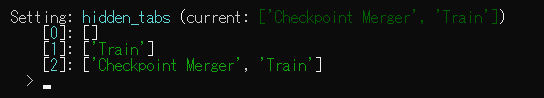

# SD Webui Launch Options
This is an Extension for the [Automatic1111 Webui](https://github.com/AUTOMATIC1111/stable-diffusion-webui), which allows you to change settings before the UI is loaded.

> Also supports [Forge](https://github.com/lllyasviel/stable-diffusion-webui-forge)

## Problem Statement

Wanna use a different checkpoint than last time when launching the Webui, but hate the time it takes to reload the model?

Introducing, **Launch Options**! Whenever you launch the Webui, it will first ask for the options, before it finishes loading everything. So now you can always start the UI with the checkpoint of choice!

**That's not all!** The options are completely customizable. You can put any settings for it to ask:

## How to Use

- **Options**

  - You can edit the `config.yaml` **YAML** file to customize the settings to ask
  - The **key** should be the same key from the `config.json` file inside the Webui folder
  - The **value** should be an array of options to choose from
  - The values can be strings or data structures
  - Examples are included

- **Launch**
  - When you launch the Webui, it will ask for each of the settings specified in the `config.yaml`
  - You can simply press `Enter` to skip a setting _(keep the current one)_
  - or enter a `number` based on the specified options

